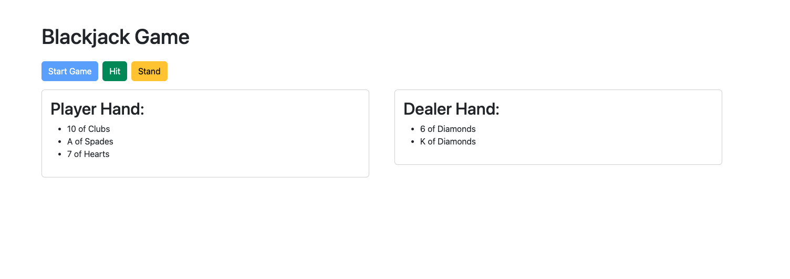

# Angular Blackjack Game

This project was generated with [Angular CLI](https://github.com/angular/angular-cli) version 17.0.9.

## Overview
This project is a simple implementation of the Blackjack card game using Angular. The core functionality includes dealing cards, player actions (hit, stand), and determining the winner based on the game rules.

Rules: https://bicyclecards.com/how-to-play/blackjack/

## Technologies Used
- Angular: The project is built using the Angular framework.
- Bootstrap: Bootstrap is used as the design system library for styling and UI components.

## Installation
To run this project locally, follow these steps:

### Clone the repository:
git clone https://github.com/your-username/angular-blackjack-game.git

### Install dependencies:
npm install

### Run the development server:
ng serve

The application will be available at http://localhost:4200/ in your web browser.

## How to Play
Click the "Start Game" button to begin a new Blackjack game.
Use the "Hit" and "Stand" buttons to make player actions during the game.
The game will automatically determine the winner based on the Blackjack rules.

## Project Structure
The key project files and directories are structured as follows:

src/app/: Angular application code.

app.component.ts: Main component handling UI and user interactions.
services/blackjack.service.ts: Service managing game logic and state.
services/deck.service.ts: Service for generating and managing the deck of cards.
models/card.model.ts: Interface for defining the Card data structure.

## Additional Notes
The application uses Bootstrap for styling and UI components to ensure a clean and responsive design.